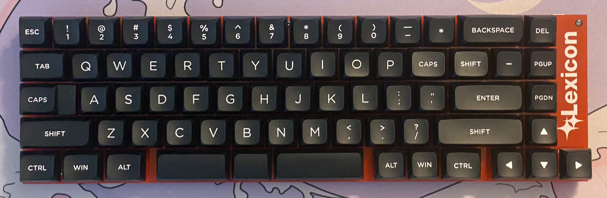

# Lexicon 65% Writing Keyboard

The Lexicon (or if you prefer the Lexicon 69 or the Cluney №3) is a 65% keyboard designed for writing prose, available from [WeirdLittleKeebs](https://www.weirdlittlekeebs.com/).

## [Build Guide](https://github.com/nekoewen/lexicon/blob/main/Lexicon%20Build%20Guide.pdf)

## [User's Guide](https://github.com/nekoewen/lexicon/blob/main/Lexicon%20User's%20Guide.pdf)
