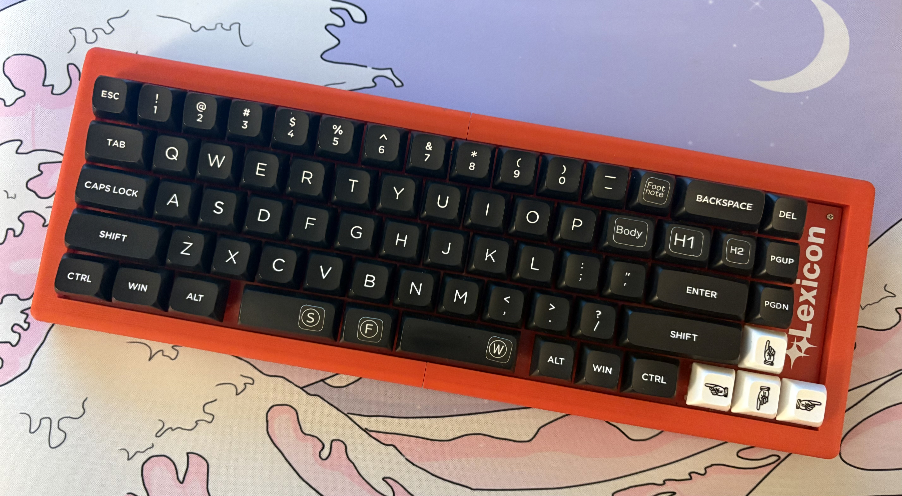

#Lexicon Case

This is a 3D-printable case designed by my good friend [Yenway](https://bsky.app/profile/did:plc:wb7yazpx56bxjeegsce3ni7f). It's made to be printed in two halves that can friction fit together with a pair of printed bars. Those and attaching the PCB make it feel fairly solid. It replaces the keyboard's bottom plate, and has divots for attaching eight adhesive rubber feet.

With PLA I've been able to print these without needing any supports, but it may become necessary for PETG. I recommend using variable layer height to reduce layer lines on the top.

